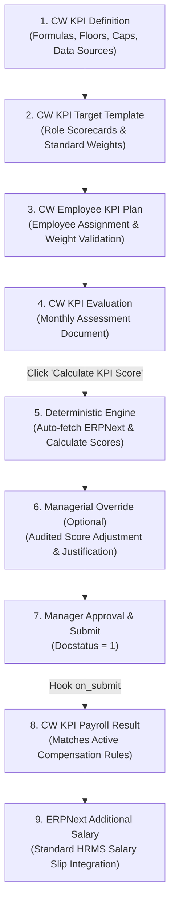

# C-Water KPI Management System - Step-by-Step Testing & UAT Guide

## 1. Executive Summary & Architecture Overview

The **C-Water KPI Management System** (`cw_kpi_management`) is an enterprise-grade performance scorecard and incentive calculation engine built for Frappe & ERPNext v16. It replaces manual spreadsheets with a deterministic, fully auditable, and automated workflow:



---

## 2. Test Environment & Roles Matrix

### 2.1 Required User Roles & Permissions

Ensure your testing user has the required roles assigned in **Desk > User > Roles**:

| Role | Permissions & Access Scope |
| :--- | :--- |
| **System Manager** | Unrestricted access across all DocTypes, settings, and payroll handoffs. |
| **CW KPI Administrator** | Full read, write, create, and submit access to KPI Definitions, Templates, Plans, Evaluations, and Compensation Rules. |
| **CW Department Manager** | Read & write access to Plans and Evaluations for employees in their department; authority to apply overrides and approve evaluations. |
| **Employee** | Read-only access filtered strictly to their own KPI Plans and Evaluations. |

### 2.2 Master Data Preconditions

Before beginning tests, ensure the following standard ERPNext records exist:
1. **Company**: `C-Water` (or your active operating company).
2. **Department**: `Technical Support` and `Sales`.
3. **Employee**: At least one active employee (e.g., `EMP-0001` - `Ahmed Al-Mansoor`) assigned to Department `Technical Support` with a linked User Account.
4. **Salary Component**: `Performance Bonus` (Type: `Earning`) and `Special Allowance`.
5. **Salary Structure Assignment**: Active assignment for the test employee so payroll tests can verify base salary linkages.

---

## 3. Step 1: Verify & Configure KPI Definitions (`CW KPI Definition`)

In this step, we verify that KPI metrics are correctly defined with data sources, directionality, floors, and caps.

### Navigation:
> **Desk > Awesomebar** > Search **"CW KPI Definition List"**

### Test Procedure:

1. **Verify Default Preloaded Fixtures**:
   Open each preloaded KPI and confirm its parameters:
   - **`KPI-VISIT-CNT` (Completed Verified Visits)**:
     - Department: `Technical Support`
     - KPI Type: `Count Target`
     - Directionality: `Higher is Better`
     - Data Source: `CW Site Visits`
     - Min Score: `0.0`, Max Score: `120.0`
     - Cap Achievement %: `120.0` *(permits up to 120% over-achievement)*
     - Floor Achievement %: `60.0` *(if actual < 60% of target, score drops to 0%)*
   - **`KPI-ATTENDANCE` (Monthly Punctuality & Attendance)**:
     - KPI Type: `Attendance-derived`
     - Directionality: `Higher is Better`
     - Data Source: `ERPNext Attendance`
     - Floor Achievement %: `75.0`
   - **`KPI-MANAGER-RATING` (Professional Attitude & HSE Compliance)**:
     - KPI Type: `Manual/Manager Rating`
     - Data Source: `Manual Entry`

2. **Create a Custom Range-Based KPI (Optional / Chemical Quality Test)**:
   - Click **Add CW KPI Definition**:
     - KPI Code: `KPI-WATER-PH`
     - KPI Name: `Product Water pH Stability`
     - Department: `Technical Support`
     - KPI Type: `Range-based`
     - Directionality: `Range is Best`
     - Range Min: `7.0`
     - Range Max: `8.0`
     - Data Source: `Manual Entry`
     - Default Weight: `20.0`
   - Click **Save**.

✅ **Expected Result**: All KPI definition records are saved and active (`is_active = 1`).

---

## 4. Step 2: Create a KPI Period (`CW KPI Period`)

A KPI Period defines the calendar boundary for tracking actual transactions (visits, attendance, revenue).

### Navigation:
> **Desk > Awesomebar** > Search **"CW KPI Period List"** > Click **Add CW KPI Period**

### Test Procedure:
1. Enter the following fields:
   - **Period Name**: `September 2026`
   - **Period Code**: `2026-09`
   - **Period Type**: `Monthly`
   - **Start Date**: `2026-09-01`
   - **End Date**: `2026-09-30`
   - **Status**: `Open`
2. Click **Save**.

✅ **Expected Result**: Period document saves with status `Open`.

---

## 5. Step 3: Create a Target Template (`CW KPI Target Template`)

Target Templates allow HR to standardize KPI scorecards across job roles without manual re-entry.

### Navigation:
> **Desk > Awesomebar** > Search **"CW KPI Target Template List"** > Click **Add CW KPI Target Template**

### Test Procedure:
1. Enter template details:
   - **Template Name**: `Field Engineer Standard Scorecard`
   - **Department**: `Technical Support`
   - **Designation**: `Field Service Engineer`
2. In the **Template Items** child table, add the following rows:

| KPI Definition | KPI Name | Target Value | Weight (%) | Min Threshold | Max Threshold |
| :--- | :--- | :---: | :---: | :---: | :---: |
| `KPI-VISIT-CNT` | Completed Verified Visits | `25.0` | `40.0` | `15.0` | `30.0` |
| `KPI-ATTENDANCE` | Monthly Attendance | `95.0` | `30.0` | `75.0` | `100.0` |
| `KPI-MANAGER-RATING`| Professional HSE & Attitude | `100.0`| `30.0` | `60.0` | `100.0` |

3. Confirm that the sum of weights is exactly:
   $$40\% + 30\% + 30\% = 100\%$$
4. Click **Save**.

✅ **Expected Result**: Template is created and ready for employee assignment.

---

## 6. Step 4: Create & Validate Employee KPI Plan (`CW Employee KPI Plan`)

In this step, we test the plan creation, automatic template inheritance, and the **strict 100% weight validation rule**.

### Navigation:
> **Desk > Awesomebar** > Search **"CW Employee KPI Plan List"** > Click **Add CW Employee KPI Plan**

### Test 4.1: Template Auto-Population
1. Select **Employee**: `EMP-0001` (Ahmed Al-Mansoor).
2. Select **KPI Period**: `September 2026`.
3. Select **Target Template**: `Field Engineer Standard Scorecard`.
4. Observe that the client script immediately populates the `plan_items` table with the 3 template rows and sets `Total Weight = 100.0%`.

### Test 4.2: Negative Validation Test (Weight Sum Mismatch)
1. In the `plan_items` table, change the weight of `KPI-VISIT-CNT` from `40.0` to `30.0` (Total becomes `90.0%`).
2. Click **Save**.
3. **System Behavior**: The server throws a validation error:
   > *"The sum of KPI weights must equal 100%. Current sum: 90.0%"*
4. Next, change the weight to `55.0` (Total becomes `115.0%`).
5. Click **Save**.
6. **System Behavior**: The server throws:
   > *"The sum of KPI weights must equal 100%. Current sum: 115.0%"*

### Test 4.3: Successful Activation
1. Restore the weight of `KPI-VISIT-CNT` to `40.0` (Total weight = `100.0%`).
2. Set **Status**: `Active`.
3. Click **Save**.

✅ **Expected Result**: The plan saves successfully with `total_weight = 100.00` and displays the custom action button **"Create Evaluation"**.

---

## 7. Step 5: Execute KPI Evaluation (`CW KPI Evaluation`)

In this step, we test the evaluation lifecycle: fetching actuals from ERPNext transactions, executing deterministic math, and generating performance grades.

### Navigation:
> In the active `CW Employee KPI Plan`, click **Actions > Create Evaluation**  
> *(Or go to **CW KPI Evaluation List** > Click **Add CW KPI Evaluation**)*

### Test 5.1: Create Evaluation Document
1. If created from the plan: `Employee`, `KPI Period`, `KPI Plan`, and `Department` are prefilled.
2. In the top toolbar, click **Tools > Load Lines from Plan** (if lines are empty).
3. Confirm that 3 lines are loaded:
   - Line 1: `KPI-VISIT-CNT` (Target: 25, Weight: 40%)
   - Line 2: `KPI-ATTENDANCE` (Target: 95, Weight: 30%)
   - Line 3: `KPI-MANAGER-RATING` (Target: 100, Weight: 30%)
4. Click **Save**. Status is `Draft`.

### Test 5.2: Set Actual Values & Execute Calculation Engine
For testing purposes, test both automated fetch and manual entries:
1. In the `evaluation_lines` table:
   - For `KPI-VISIT-CNT`: Set `actual_value = 24.0` (or let it auto-fetch from submitted `CW Site Visit` records).
   - For `KPI-ATTENDANCE`: Set `actual_value = 96.0` (or let it auto-fetch from HR `Attendance` records).
   - For `KPI-MANAGER-RATING`: Set `actual_value = 90.0`.
2. Click **Save**.
3. In the top toolbar, click **Actions > Calculate KPI Score**.
4. Confirm prompt alert: *"KPI calculation completed. Score: 93.4"*.

### Test 5.3: Verify Mathematical Scoring & Trace

Inspect the values in each line of the evaluation table:

#### Line 1: Completed Verified Visits (`KPI-VISIT-CNT`)
- Target: `25.0`, Actual: `24.0`, Weight: `40%`
- Achievement %:
  $$\left(\frac{24}{25}\right) \times 100 = 96.00\%$$
- Since $96.0\% > \text{Floor}(60\%)$ and $\le \text{Cap}(120\%)$, Score = $96.00$.
- Weighted Score:
  $$96.00 \times \left(\frac{40}{100}\right) = 38.40$$
- Calculation Notes Trace confirms:
  `Input: actual=24.0, target=25.0 | Higher is Better: (24.0 / 25.0) * 100 = 96.00% | Score bounded to [0.0, 120.0]: 96.00 | Weighted Score: 96.00 * (40.0% / 100) = 38.40`

#### Line 2: Monthly Attendance (`KPI-ATTENDANCE`)
- Target: `95.0`, Actual: `96.0`, Weight: `30%`
- Direct metric score applied: $96.00\%$
- Weighted Score:
  $$96.00 \times \left(\frac{30}{100}\right) = 28.80$$

#### Line 3: Professional HSE & Attitude (`KPI-MANAGER-RATING`)
- Target: `100.0`, Actual: `90.0`, Weight: `30%`
- Score: $90.00$
- Weighted Score:
  $$90.00 \times \left(\frac{30}{100}\right) = 27.00$$

#### Document Totals & Performance Grade:
- **Total Weighted Score**:
  $$38.40 + 28.80 + 27.00 = 94.20$$
- **Final Score**: `94.20`
- **Grade**: Automatically calculated as:
  **`A - Outstanding (90-100%)`**
- **Status**: Updated to `Calculated`.

✅ **Expected Result**: Exact mathematical precision with zero rounding discrepancy and clear audit traces.

---

## 8. Step 6: Test Managerial Overrides & Audit Trail

In real-world operations, exceptional events (e.g. road closure, client factory shutdown) may warrant an executive override. This test verifies the secure override modal and audit log.

### Test Procedure:

1. On the `Calculated` evaluation, click **Actions > Apply Manual Override**.
2. A modal dialog **"Manual Score Adjustment"** opens.
3. Test mandatory validation: Leave **Mandatory Justification Reason** empty and submit.
   - **System Behavior**: Form prevents submission until justification is supplied.
4. Fill in the modal:
   - **Select KPI**: `Completed Verified Visits (KPI-VISIT-CNT)`
   - **New Score (0-100)**: `100.0`
   - **Mandatory Justification Reason**: *"Client plant was closed 2 days for statutory fire drill outside engineer control. Target adjusted to 100%."*
5. Click **Submit**.
6. The document automatically reloads:
   - Notice that for Line 1, `Manual Override Score` is now `100.00`.
   - `Final Line Score` is `100.00`.
   - Line 1 `Weighted Score` updates:
     $$100.00 \times 40\% = 40.00$$
   - New Document Total Score:
     $$40.00 + 28.80 + 27.00 = 95.80$$
7. Scroll down to the **Overrides Audit Trail** child table (`overrides`):
   - Row 1 shows:
     - **KPI Definition**: `KPI-VISIT-CNT`
     - **Previous Score**: `96.0`
     - **New Score**: `100.0`
     - **Override Reason**: *"Client plant was closed 2 days..."*
     - **Override By**: Your User ID (e.g. `Administrator`)
     - **Override Timestamp**: Current timestamp

✅ **Expected Result**: Audited override applies cleanly, preserves original scores, and recalculates totals and grades.

---

## 9. Step 7: Test Approval & Submission Guard

### Test 7.1: Submission Guard Test
1. Set status to `Draft` or `Calculated`.
2. Attempt to click **Submit** at the top right of the Desk document.
3. **System Behavior**: The server throws a validation error:
   > *"Evaluation cannot be submitted until status is Approved by an authorized manager."*

### Test 7.2: Manager Approval & Submit
1. Change **Status** to `Approved`.
2. Enter **Approver Remarks**: *"Approved for Q3 field performance incentive."*
3. Click **Save**.
4. Click **Submit** (Confirm document submission).
5. Document status transitions to `Submitted` (`docstatus = 1`).

✅ **Expected Result**: Document is locked against further edits. Approver stamp and approval timestamp are permanently set.

---

## 10. Step 8: Test Payroll Integration & ERPNext Additional Salary

When an evaluation is approved and submitted, the `on_evaluation_submit` hook automatically matches active `CW KPI Compensation Rule` records and queues financial bonuses.

### Test 8.1: Verify Compensation Rule Matching
Preloaded rule `RULE-ENGINEER-BONUS` specifies:
- Department: `Technical Support`
- Min Score: `85.0`, Max Score: `120.0`
- Calculation Method: `Fixed Amount`
- Amount: `1,500.00 EGP`
- Salary Component: `Performance Bonus`

Since Ahmed Al-Mansoor achieved a score of **`95.80%`**, he qualifies for this incentive tier.

### Test 8.2: Verify CW KPI Payroll Result Record
1. Navigate to **Desk > Awesomebar** > Search **"CW KPI Payroll Result List"**.
2. Locate the newly created record for `EMP-0001`:
   - **Employee**: `EMP-0001`
   - **KPI Period**: `September 2026`
   - **KPI Evaluation**: Linked to your submitted evaluation document
   - **Compensation Rule**: `RULE-ENGINEER-BONUS`
   - **Score**: `95.80`
   - **Amount**: `1,500.00`
   - **Salary Component**: `Performance Bonus`
   - **Status**: `Processed in Payroll`

### Test 8.3: Verify Standard ERPNext `Additional Salary` Document
1. Navigate to **Desk > Awesomebar** > Search **"Additional Salary List"**.
2. Locate the document generated for `EMP-0001`:
   - **Employee**: `EMP-0001`
   - **Salary Component**: `Performance Bonus`
   - **Amount**: `1,500.00`
   - **Payroll Date**: `2026-09-30`
   - **Remarks**:
     `"Generated from approved CW KPI Evaluation EVAL-2026-00001 (Score: 95.8)"`
   - **Docstatus**: `1` (Submitted).

### Test 8.4: Verify Standard ERPNext `Salary Slip` Generation
1. Navigate to **Desk > Awesomebar** > Search **"Salary Slip List"** > Click **Add Salary Slip**.
2. Select **Employee**: `EMP-0001` (Ahmed Al-Mansoor).
3. Select **Posting Date**: `2026-09-30`.
4. Select **Start Date**: `2026-09-01`, **End Date**: `2026-09-30`.
5. Observe the **Earnings Table**:
   - Standard Base Salary is populated from the Salary Structure Assignment.
   - An extra earning row **`Performance Bonus`** is automatically included with Amount = **`1,500.00`** and linked to the Additional Salary record!

✅ **Expected Result**: Seamless end-to-end integration from operational field execution to the employee's net take-home salary.

---

## 11. Step 9: Automated Command-Line Unit Test Suite

For automated regressions and CI/CD verification, run the automated Python test suite:

### Execution Command:
```bash
python -m pytest cw_kpi_management/cw_kpi_management/tests -v
```

### Expected Output:
```text
============================= test session starts =============================
platform win32 -- Python 3.14.3, pytest-9.1.1, pluggy-1.6.0
rootdir: C:\Data\Nest Software Development\Work\Cwater\ERPNext_Customization\cw_kpi_management
collected 12 items

cw_kpi_management\cw_kpi_management\tests\test_kpi_engine.py::TestKPICalculationEngine::test_attendance_and_manual_rating PASSED [  8%]
cw_kpi_management\cw_kpi_management\tests\test_kpi_engine.py::TestKPICalculationEngine::test_higher_is_better_floor_penalty PASSED [ 16%]
cw_kpi_management\cw_kpi_management\tests\test_kpi_engine.py::TestKPICalculationEngine::test_higher_is_better_normal PASSED [ 25%]
cw_kpi_management\cw_kpi_management\tests\test_kpi_engine.py::TestKPICalculationEngine::test_higher_is_better_overachievement_capped PASSED [ 33%]
cw_kpi_management\cw_kpi_management\tests\test_kpi_engine.py::TestKPICalculationEngine::test_lower_is_better PASSED [ 41%]
cw_kpi_management\cw_kpi_management\tests\test_kpi_engine.py::TestKPICalculationEngine::test_range_based_optimal PASSED [ 50%]
cw_kpi_management\cw_kpi_management\tests\test_kpi_engine.py::TestKPICalculationEngine::test_threshold_pass_and_fail PASSED [ 58%]
cw_kpi_management\cw_kpi_management\tests\test_kpi_evaluation.py::TestKPIEvaluation::test_grade_ratings PASSED [ 66%]
cw_kpi_management\cw_kpi_management\tests\test_kpi_evaluation.py::TestKPIEvaluation::test_plan_weight_sum_valid PASSED [ 75%]
cw_kpi_management\cw_kpi_management\tests\test_payroll_integration.py::TestPayrollIntegration::test_compensation_rule_computation_fixed PASSED [ 83%]
cw_kpi_management\cw_kpi_management\tests\test_payroll_integration.py::TestPayrollIntegration::test_compensation_rule_computation_graduated PASSED [ 91%]
cw_kpi_management\cw_kpi_management\tests\test_payroll_integration.py::TestPayrollIntegration::test_payroll_result_payload_structure PASSED [100%]

============================= 12 passed in 0.24s ==============================
```

---

## 12. Complete UAT Acceptance Checklist

Print or use this checklist during User Acceptance Testing (UAT) sign-off:

| # | Test Scenario | Expected Outcome | Result | Sign-off |
| :-: | :--- | :--- | :---: | :---: |
| **1** | Open preloaded KPI Definitions | Fixtures load with correct data sources, floors, and caps | `PASS` | ☐ |
| **2** | Create Open KPI Period | Period saves with Start/End date bounds | `PASS` | ☐ |
| **3** | Create Target Template | Child table sums to 100% | `PASS` | ☐ |
| **4** | Employee Plan Weight < 100% | System blocks save with descriptive error | `PASS` | ☐ |
| **5** | Employee Plan Weight > 100% | System blocks save with descriptive error | `PASS` | ☐ |
| **6** | Employee Plan Weight = 100% | Plan saves and activates cleanly | `PASS` | ☐ |
| **7** | "Load Lines from Plan" in Evaluation | Target values and weights accurately copy over | `PASS` | ☐ |
| **8** | Click "Calculate KPI Score" | Real-time calculation completes; achievement % and traces recorded | `PASS` | ☐ |
| **9** | Floor Penalty Behavior | Score drops to 0% if actual is below floor % | `PASS` | ☐ |
| **10** | Over-achievement Capping | Score is capped at defined cap % (e.g. 120%) | `PASS` | ☐ |
| **11** | Grade Letter Assignment | Score accurately maps to Grade A, B, C, D, or F | `PASS` | ☐ |
| **12** | Apply Manual Override | Modal prompts for new score and mandatory reason | `PASS` | ☐ |
| **13** | Override Audit Trail | `overrides` table logs previous score, new score, user, and timestamp | `PASS` | ☐ |
| **14** | Submit without Approval Guard | System blocks submission if status != `Approved` | `PASS` | ☐ |
| **15** | Submit with Approval | Document locks (`docstatus = 1`); approver recorded | `PASS` | ☐ |
| **16** | Automatic Payroll Result Creation | `CW KPI Payroll Result` created with matching compensation tier | `PASS` | ☐ |
| **17** | ERPNext `Additional Salary` Bridge | Standard `Additional Salary` document created and submitted | `PASS` | ☐ |
| **18** | ERPNext `Salary Slip` Inclusion | Incentive bonus automatically pulls into employee pay slip | `PASS` | ☐ |
| **19** | CLI Regression Suite | `pytest` passes 12/12 unit tests | `PASS` | ☐ |

---

### UAT Sign-Off Authorization

- **Lead Tester**: _______________________ &nbsp;&nbsp;&nbsp;&nbsp; **Date**: __________________
- **HR / Operations Manager**: _______________________ &nbsp;&nbsp;&nbsp;&nbsp; **Date**: __________________
- **System Administrator**: _______________________ &nbsp;&nbsp;&nbsp;&nbsp; **Date**: __________________
