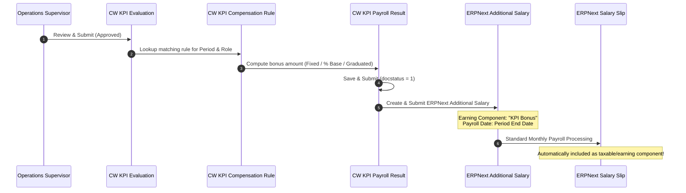

# C-Water KPI & ERPNext Payroll Integration Guide

## 1. Overview & Architecture

One of the cornerstone requirements of the C-Water solution is the seamless, automated, and tamper-proof conversion of monthly KPI performance grades into payroll bonus compensations.

To ensure **100% upgrade safety** across current and future ERPNext / HRMS releases, the integration operates strictly through standard ERPNext documents:



---

## 2. Upgrade-Safe Design

### Why NOT Modify `Salary Slip` Directly?
Modifying core `Salary Slip` controllers or adding custom Python hooks into HRMS payroll cycles introduces severe risks:
1. Future ERPNext/HRMS updates frequently refactor payroll calculation logic.
2. Direct edits can break concurrent payroll processing runs.
3. Rollbacks or recalculations of salary slips can overwrite or desynchronize performance data.

### The `Additional Salary` Bridge Strategy:
ERPNext provides the `Additional Salary` DocType specifically for dynamic bonuses, incentives, and allowances. By creating an approved `Additional Salary` document:
- The bonus flows into the employee's next regular pay slip with zero core code intrusion.
- Complete audit trails are preserved: Employee -> KPI Evaluation -> Payroll Result -> Additional Salary -> Salary Slip.
- The standard ERPNext general ledger and payroll accounting postings remain entirely intact.

---

## 3. Compensation Rule Configuration

The `CW KPI Compensation Rule` DocType defines how grades map to financial incentives.

### 3.1 Compensation Models Supported:

1. **Fixed Amount Model**:
   - Explicit cash payout based on grade.
   - *Example*:
     - Grade A ($90-100\%$): **SAR 2,500**
     - Grade B ($80-89\%$): **SAR 1,500**
     - Grade C ($70-79\%$): **SAR 500**
     - Grade D/F ($<70\%$): **SAR 0**

2. **Percentage of Base Salary**:
   - Queries the employee's active `Salary Structure Assignment` in ERPNext HRMS to determine base monthly wage.
   - Payout calculated as a percentage of base.
   - *Example*:
     - Grade A: $25\%$ of Base Salary
     - Grade B: $15\%$ of Base Salary
     - Grade C: $5\%$ of Base Salary

3. **Graduated / Continuous Model**:
   - Bonus is scaled proportionally between the minimum eligibility threshold ($70\%$) and the maximum cap ($100\%$).
   $$\text{Bonus} = \text{Max Bonus} \times \left( \frac{\text{Score} - 70}{30} \right)$$

---

## 4. Integration Step-by-Step Walkthrough

### Step 1: Submitting KPI Evaluation
When a supervisor reviews an employee's scorecard in `CW KPI Evaluation` and clicks **Submit**:
- The document validates all lines.
- Computes weighted overall score (e.g. $94.2\%$) and assigns grade `A`.
- Advances `docstatus` to `1` (Submitted).

### Step 2: Triggering Payroll Incentive Generation
- Either automatically via the `on_submit` controller hook or manually via the Desk button **"Generate Payroll Incentive"**.
- Calls `cw_kpi_management.payroll_integration.create_payroll_incentive(eval_doc)`.

### Step 3: Creation of `CW KPI Payroll Result`
- Creates a `CW KPI Payroll Result` document linking:
  - `employee`: Target employee ID.
  - `kpi_evaluation`: Evaluated document name.
  - `evaluation_period`: Target payroll month.
  - `overall_score`: Final evaluated percentage.
  - `grade`: Final grade letter.
  - `incentive_amount`: Calculated currency bonus.
  - `salary_component`: e.g. `"KPI Incentive Bonus"`.

### Step 4: Submission of Standard `Additional Salary`
The system creates and submits an ERPNext `Additional Salary` record:
```json
{
  "doctype": "Additional Salary",
  "employee": "HR-EMP-00124",
  "salary_component": "KPI Incentive Bonus",
  "payroll_date": "2026-09-30",
  "amount": 2500.0,
  "type": "Earning",
  "overwrite_salary_structure_amount": 0,
  "ref_doctype": "CW KPI Payroll Result",
  "ref_docname": "KPI-PAY-2026-00001"
}
```

---

## 5. Payroll Reconciliation & Audit Report

Navigate to `Field Service & KPI Reports > KPI Payroll Reconciliation`:
- Displays side-by-side reconciliation between:
  1. KPI Evaluation Score & Grade
  2. Generated Payroll Result Amount
  3. Linked `Additional Salary` record status
  4. Final `Salary Slip` payment status
- Any discrepancies, cancellations, or unlinked records are flagged in high-visibility red.
